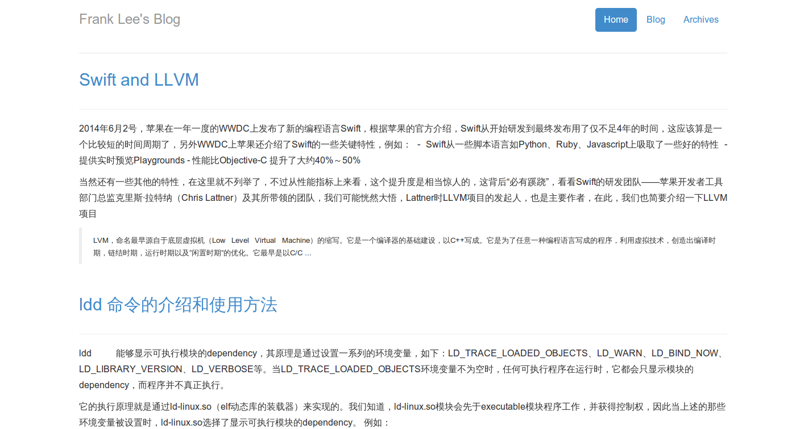

pelican_theme_simple_bootstrap
==============================

根据自己的需求修改的pelican主题
------------

将该文件下载到本地并做相应的修改netdna.bootstrapcdn.com/bootstrap/3.0.0/css/bootstrap.min.css
1. 页面变宽了
2. 字体修改为16px
3. 正文两端对齐

